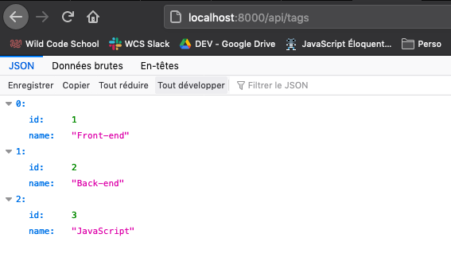
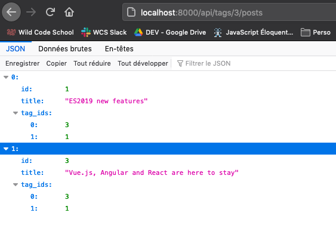
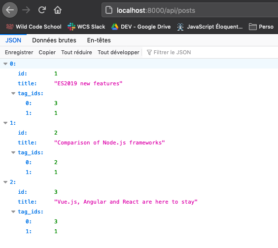

# Express Router quest

# Challenge







## Get it

Clone the repo and install the dependencies:

```sh
git clone https://github.com/WildCodeSchool/express-router-quest.git
npm install
```

## Start it

Run the server (uses Nodemon):

```sh
npm start
```

## Lint the code

For perfectionists out there (runs ESLint with auto-fix):

```sh
npm run lint
```

